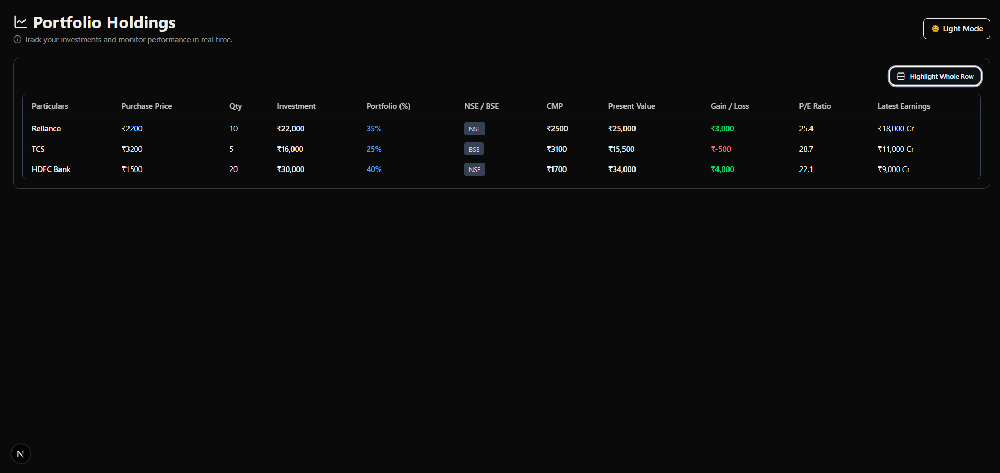
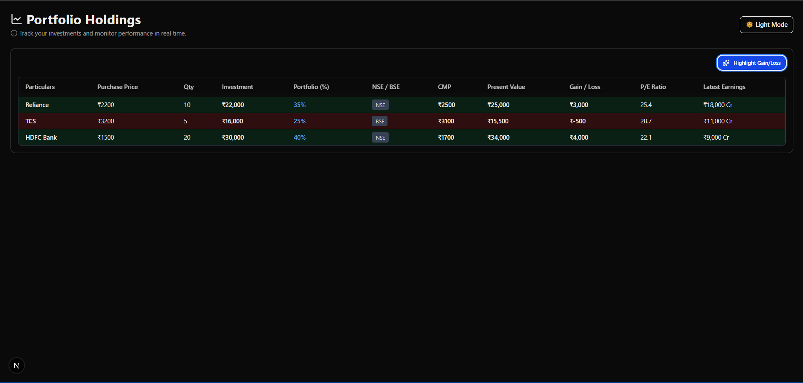
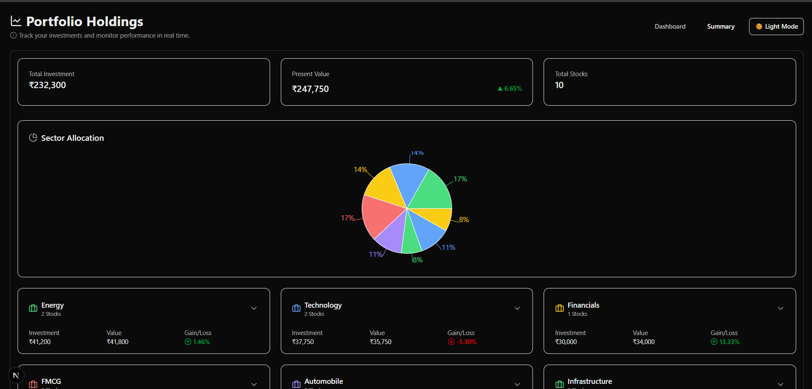
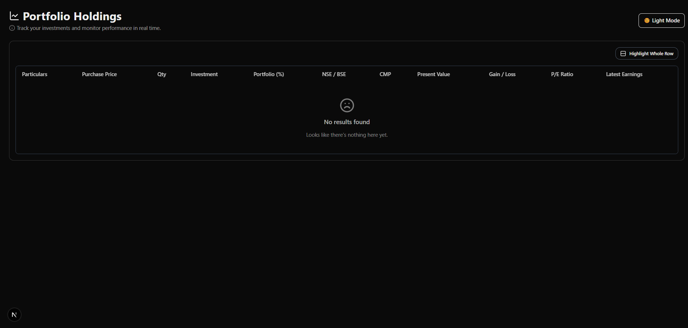

# Dynamic Portfolio Dashboard

A real-time portfolio tracking application built with Next.js, TypeScript, and TailwindCSS. Monitor your stock portfolio with live data from Yahoo Finance and Financial Modeling Prep APIs.


## ✨ Features

- 📊 Real-time stock price tracking
- 📈 Portfolio performance visualization
- 🎨 Dark/Light theme support
- 📱 Responsive design
- 📊 Interactive data tables
- 🔄 Auto-refresh every 15 minutes
- 📋 CSV portfolio upload
- 📊 Sector-wise portfolio analysis

## 🛠 Tech Stack

- [Next.js 14](https://nextjs.org/)
- [TypeScript](https://www.typescriptlang.org/)
- [TailwindCSS](https://tailwindcss.com/)
- [Supabase](https://supabase.com/)
- [Tanstack Table](https://tanstack.com/table/v8)
- [Recharts](https://recharts.org/)
- [Yahoo Finance API](https://github.com/gadicc/node-yahoo-finance2)
- [Financial Modeling Prep API](https://financialmodelingprep.com/developer/docs)

## 📦 Installation

1. Clone the repository:
```bash
git clone https://github.com/yourusername/dynamic-portfolio-dashboard.git
cd dynamic-portfolio-dashboard
```

2. Install dependencies:
```bash
npm install
# or
yarn install
```

3. Create a `.env.local` file in the root directory with the following variables:
```env
NEXT_PUBLIC_SUPABASE_URL=your_supabase_url
SUPABASE_SERVICE_ROLE_KEY=your_supabase_service_key
FMP_API_KEY=your_financial_modeling_prep_api_key
```

4. Create the required table in Supabase:
```sql
create table if not exists portfolio (
  id bigint generated always as identity primary key,
  stockid text not null,
  purchasevalue numeric not null,
  qty int not null,
  exchange text,
  sector text,
  created_at timestamptz default now()
);
```

## 🚀 Running the Project

1. Start the development server:
```bash
npm run dev
# or
yarn dev
```

2. Open [http://localhost:3000](http://localhost:3000) in your browser

## 📄 CSV Format

To upload your portfolio, create a CSV file with the following format:

```csv
STOCKID,PURCHASE_VALUE,QTY,EXCHANGE,SECTOR
AAPL,150.00,10,NASDAQ,Technology
GOOGL,2800.00,5,NASDAQ,Technology
```

## 🔑 API Keys

1. **Financial Modeling Prep API**:
   - Sign up at [financialmodelingprep.com](https://financialmodelingprep.com/)
   - Get your API key from the dashboard

2. **Supabase**:
   - Create a project at [supabase.com](https://supabase.com)
   - Get your project URL and service role key

## 🛠 Development

- `src/components/*` - React components
- `src/lib/*` - Utility functions and API clients
- `src/types/*` - TypeScript type definitions
- `src/backend/*` - Backend services and API handlers

## Images




